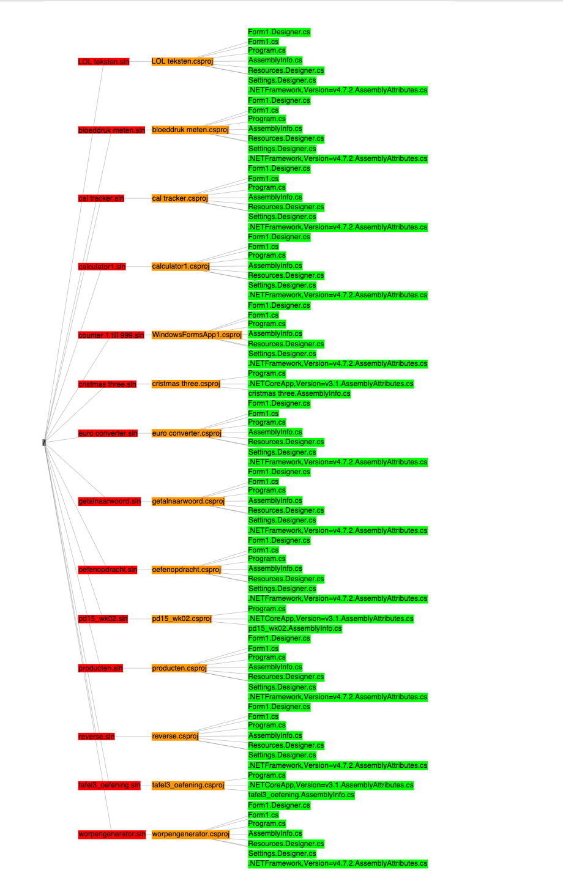
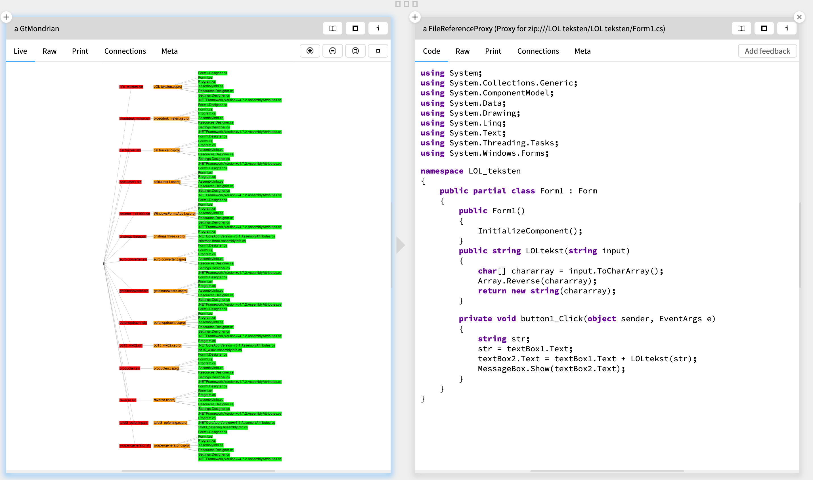

# GlamorousAdventures

Learning my way around in the
[Glamorous Toolkit](https://gtoolkit.com/).

After my
[Moose adventure visualizing directories containing student work](https://github.com/coentjo/cmbDirVisualizer) I am looking to take this a step further:

## Can I visualize a zip containing students work in a way that makes giving feedback easier and possibly more fun?

or, with source of one file opened:

## What would be an easy way to give/store this feedback?
